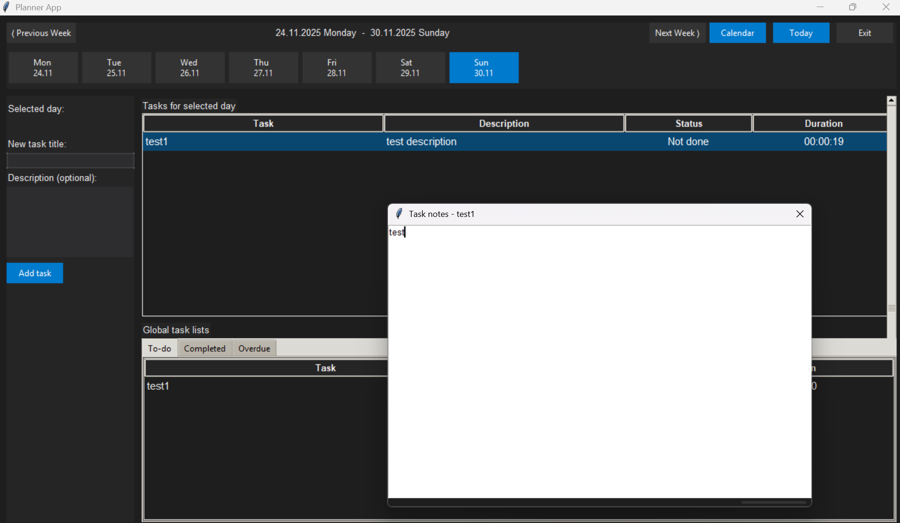

<h1 align="center">🗓️ Planner App</h1>

<p align="center">
  A clean, modern and dark-themed Weekly/Daily Planner built with <b>Python Tkinter</b>, featuring task timing, notes, calendar navigation and advanced task filtering.
</p>

<p align="center">
  
</p>

---

## ✨ Features

### 📆 Weekly & Daily Task Management
- Navigate weeks with **Previous / Next** controls  
- Jump to any day using the **built-in calendar window**  
- Add tasks with optional descriptions  
- English, clean, modern interface

### ⏱️ Smart Task Timing
- Start/stop timers per task  
- Live duration updates (hh:mm:ss)  
- Accumulated time stored in SQLite

### 📝 Per-Task Notes (Auto-Saved)
- Right-click → **Open Notes**  
- Notes saved as `.txt` under `/notes/taskID.txt`  
- Automatically loads when reopened

### 📋 Global Task Filters
Built-in automatic lists:
- **To-do** → Pending tasks  
- **Completed** → Finished tasks  
- **Overdue** → Tasks past their due date  

### 🎨 Modern Dark UI
- Styled buttons, soft color palette  
- Responsive Treeviews  
- Hover-friendly header sections  
- Unified English interface

### 💾 Local Storage
- SQLite database: `tasks.db`  
- Notes folder: `/notes/`  
- Fully portable when compiled as EXE

### 🪟 EXE Build Support
- Single portable EXE  
- Custom application icon (`planner.ico`)  
- Notes + DB auto-created next to EXE  

---

## 🚀 Installation (From Source)

Clone the repository:

```bash
git clone https://github.com/oguztoy8/Planner-App.git
cd Planner-App
````

Install dependencies (Tkinter already included in Python):

```bash
pip install -r requirements.txt   # If you add requirements later
```

Run the app:

```bash
python main.py
```

---

## 📦 Build as EXE (PyInstaller)

Run the following inside the project root:

```bash
pyinstaller --onefile --windowed --name PlannerApp --icon planner.ico main.py
```

Output:

```
/dist/PlannerApp.exe
```

✔ Notes
✔ tasks.db
will automatically be created next to the EXE.

---

## 📁 Project Structure

```
Planner-App/
│── app/
│   ├── ui.py
│   ├── week_view.py
│   ├── task_view.py
│   ├── calendar_view.py
│   ├── clock_service.py
│   ├── timer_service.py
│   ├── status_bar.py
│── assets/
│   └── screenshot.png
│── notes/
│── database.py
│── models.py
│── time_utils.py
│── main.py
│── planner.ico
│── README.md
```

---


